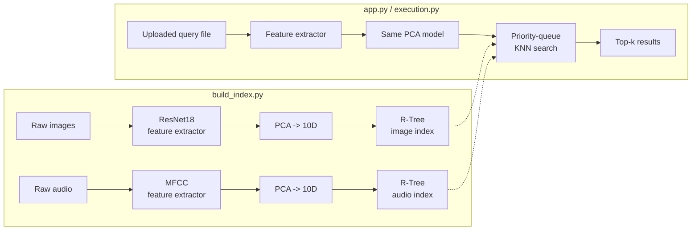

# DBMS Term Project: High-Dimensional Multimedia Retrieval

This project implements a multimedia similarity-search system for images and audio using high-dimensional feature vectors.

Core ideas:
- Feature extraction from raw media (ResNet18 embeddings for images, MFCCs for audio)
- PCA-based dimensionality reduction
- Custom R-Tree indexing (insert, delete, priority-queue KNN) for similarity retrieval
- Custom KD-Tree and linear scan for benchmark comparison
- Flask web app for search, visualization, and benchmarking

## Architecture



The R-Tree/KD-Tree/linear-scan comparison in `src/evaluation/benchmark.py` runs independently of this pipeline on synthetic vectors, so it can be benchmarked without any dataset in place.

## Project Structure

- `build_index.py`: Builds database indexes and PCA models from raw media
- `app.py`: Flask web server (UI + APIs)
- `src/index/`: R-Tree and KD-Tree implementations
- `src/search/`: Query execution and KNN search logic
- `src/evaluation/`: Visualizer + benchmark logic
- `templates/`: Frontend pages
- `tests/`: pytest suite for the index/search layer
- `data/raw_images`, `data/raw_audio`: Input datasets
- `data/processed`: Generated PCA models and tree indexes

## Requirements

- Python 3.9+
- pip
- Optional: GNU Make (for running Makefile commands)

Install dependencies:

```bash
pip install -r requirements.txt
```

## Dataset

Raw media is not committed to this repo (it's large and not ours to redistribute). Populate these folders yourself before building the index:

- `data/raw_images/` — any collection of `.jpg`/`.png` images
- `data/raw_audio/` — `.wav` files; developed and tested against [UrbanSound8K](https://urbansounddataset.weebly.com/urbansound8k.html)

`data/processed/` ships with a small pre-built PCA model + R-Tree index so the search/visualizer/benchmark pages work out of the box without rebuilding.

## Quick Start

1. Put dataset files in `data/raw_images` and `data/raw_audio` (see [Dataset](#dataset)).

2. Build indexes and PCA models:

```bash
python build_index.py
```

3. Start the web app:

```bash
python app.py
```

4. Open browser:

```text
http://127.0.0.1:5001
```

## Benchmarking

There are two benchmark paths:

1. Web benchmark page
- Start `app.py`
- Open `/benchmark`
- Uses background job APIs:
	- `POST /api/benchmark/start`
	- `GET /api/benchmark/status/<job_id>`

2. Direct benchmark script

```bash
python src/evaluation/benchmark.py
```

This compares linear scan, custom KD-Tree, and custom R-Tree across dimensions, and for every dimension also cross-checks each tree's top-k against brute-force ground truth (`recall@k`) — both trees are exact algorithms, so recall should sit at ~100%; a sustained drop below that would flag a pruning bug.

### Sample results

`N=10,000`, `k=5`, median of 20 timed queries per cell:

| Dimensions | Linear Scan (ms) | KD-Tree (ms) | R-Tree (ms) | KD-Tree Recall | R-Tree Recall |
|-----------:|------------------:|-------------:|------------:|----------------:|----------------:|
| 2  | 25.26 | 0.09  | 0.43  | 100% | 100% |
| 5  | 27.10 | 0.68  | 1.84  | 100% | 100% |
| 10 | 27.84 | 26.25 | 15.83 | 100% | 100% |
| 20 | 28.82 | 32.33 | 25.98 | 100% | 100% |
| 50 | 26.39 | 33.42 | 24.76 | 100% | 100% |

Both trees start out far faster than a brute-force scan, but the gap collapses as dimensionality grows — by 10D on uniform random data, both trees are already at or slower than linear scan. This is the **curse of dimensionality**: MBRs (and axis-aligned KD-tree splits) stop meaningfully pruning the search space once a query's neighborhood overlaps most of the volume in high-D, so the index degenerates toward scanning everything anyway, with extra traversal overhead on top. It's part of why this project reduces feature vectors to 10D with PCA before indexing, rather than indexing the raw 512D image / 40D audio embeddings directly.

## Testing

```bash
pip install -r requirements-dev.txt
pytest
```

Covers MBR geometry (volume, enlargement, intersection, containment), R-Tree insert/split structural invariants (capacity never exceeded, child MBRs never escape their parent's MBR), R-Tree/KD-Tree KNN results checked against brute-force ground truth, and deletion (point removal, non-underflowing/underflowing node condensation, root collapsing, and a randomized insert/delete/update stress test checked against a plain-dict ground truth).

## Common Workflow

1. Add/update media in raw data folders
2. Rebuild indexes with `build_index.py`
3. Run `app.py`
4. Test search and visualizer pages
5. Run benchmark page or script for performance analysis

## Troubleshooting

- `ModuleNotFoundError`:
	- Run commands from project root.
- Empty search results or errors:
	- Ensure `data/processed` has generated files after running `build_index.py`.
- Missing media in UI:
	- Confirm query/output filenames match files in `data/raw_images` and `data/raw_audio`.

## Notes

- Benchmark runtime increases with larger N and higher dimensions.
- Initial feature extraction (especially image/audio models) may take time.
